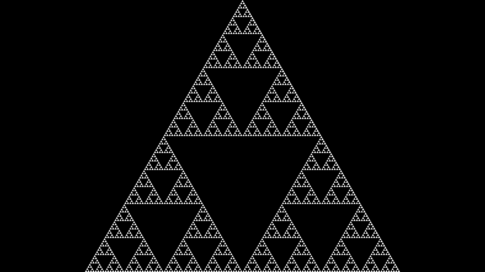

# Introduction

## What is this?

This is a small rust script I wrote to draw (approximations of) Sierpinski triangles.

## What is a Sierpinski Triangle?

https://en.wikipedia.org/wiki/Sierpi%C5%84ski_triangle

## Can I see it?

## How is it drawn?
There are a few ways to draw it, but I started off with one large triangle and then proceeded to subdivide it and color in the center part of it. I repeated this process until the center part was smaller than some threshold to stop it from looking too grainy.